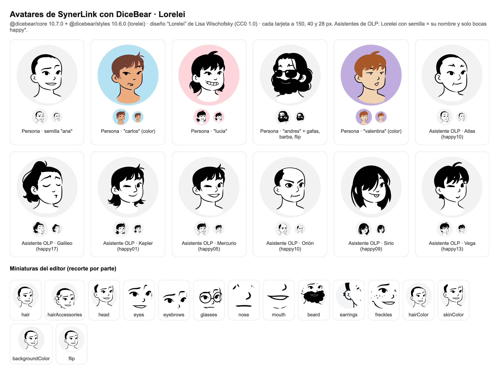
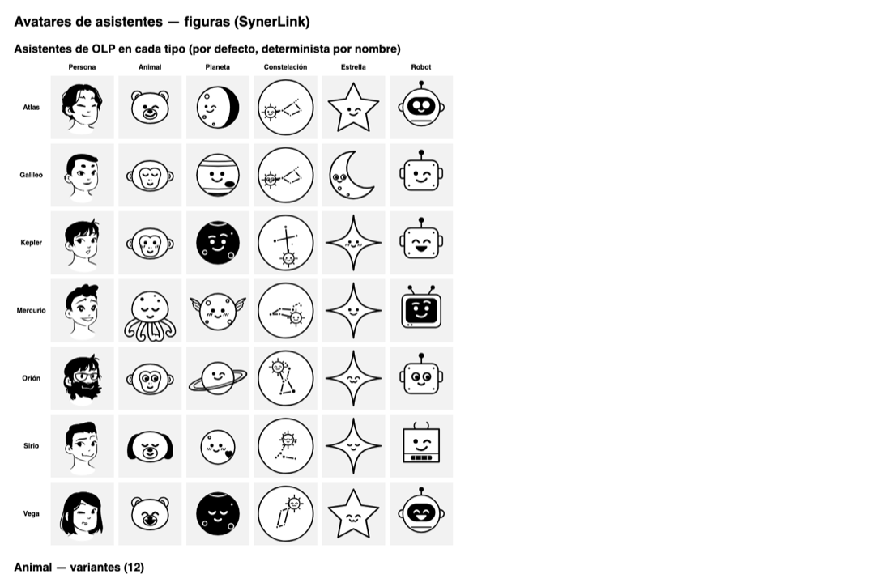

# Avatar estilo Notion (Perfil y asistentes del chat) — DiceBear 9 · Lorelei

Editor de avatar en **Perfil → Mi avatar** y, para los asistentes de los que la persona es responsable (o si es administradora), en **Perfil → Avatar de mis asistentes**.



## Versión 4 (2026-10-08): DiceBear 9 + Lorelei

Decisión de Nicolás Rivera: el feature se adapta a lo que trae la librería. El motor de piezas propio (versiones 1 a 3: piezas Noto, animales, planetas, constelaciones y prototipo a lápiz) se retiró.

- Dependencias con versión **exacta** (sin `^`): `@dicebear/core` **9.4.3** y `@dicebear/lorelei` **9.4.3**.
- **Por qué la 9 y no la 10:** DiceBear 10 (`@dicebear/core` 10 + `@dicebear/styles`) exige Node ≥ 22, y la CI y los servidores de despliegue (.230 testing y serfarma05 producción) corren Node **20.14**. Se probó la 10 y se volvió a la 9 (decisión de Nicolás Rivera, 2026-10-08); subir de versión requiere antes actualizar Node en los servidores.
- El servidor (`GET /api/avatar/user/<id>` y `GET /api/avatar/agent/<code>`) genera el SVG con `createAvatar(lorelei, opciones)`.
- El editor del Perfil usa **el mismo módulo** (`lib/avatar/compose.ts`) y pinta todo con `` (`avatarDataUri`/`thumbDataUri`), nunca SVG en línea, para que no haya diferencias de hidratación entre servidor y navegador.
- El catálogo sale del **esquema** de Lorelei instalado (`lorelei.schema.properties.*.items.enum`), no de una lista copiada.

### Opciones (exactamente las de Lorelei)

| Botón | Opción de DiceBear | Valores |
|---|---|---|
| Cabello | `hair` | 48 |
| Cabeza | `head` | 4 |
| Ojos | `eyes` | 24 |
| Cejas | `eyebrows` | 13 |
| Boca | `mouth` | 27 (18 `happy*` + 9 `sad*`); **asistentes: solo las 18 `happy*`** |
| Nariz | `nose` | 6 |
| Gafas | `glasses` / `glassesProbability` | ninguna + 5 |
| Aretes | `earrings` / `earringsProbability` | ninguno + 3 |
| Barba | `beard` / `beardProbability` | ninguna + 2 |
| Pecas | `freckles` / `frecklesProbability` | ninguna + 1 |
| Flores | `hairAccessories` / `hairAccessoriesProbability` | ninguna + flores |
| Color de cabello | `hairColor` | 7 (negro por defecto) |
| Color de piel | `skinColor` | 7 (blanco/línea por defecto) |
| Fondo | `backgroundColor` | 8 (gris claro por defecto, incluye transparente) |
| Voltear | `flip` | booleano en DiceBear 9: sin voltear / volteado (espejo) |

**Aleatorio** usa el azar de DiceBear (con las probabilidades de Lorelei: gafas 10 %, aretes 10 %, barba 5 %, pecas 5 %, flores 5 %) y conserva los colores elegidos. Lo que DiceBear elige (`toJson().extra`) se vuelve configuración explícita.

### Asistentes del chat

Si el asistente es una **persona Lorelei** aplica lo siguiente (desde el 2026-10-08 también puede ser una figura: ver «Figuras para los asistentes»).

- **Semilla = nombre del asistente** (Atlas, Galileo, Kepler, Mercurio, Orión, Sirio, Vega…). Es el avatar con el que abre el editor si aún no tiene uno, y el servidor guarda siempre `seed` = nombre del asistente.
- **Bocas limitadas a `happy*`**: el editor solo las ofrece, el aleatorio solo las elige y el servidor rechaza cualquier otra (`parseAvatarConfig(…, 'agent')`).

## Figuras para los asistentes (2026-10-08)

Pedido de Nicolás Rivera (SynerLink c47): en **Perfil → Avatar de mis asistentes** el avatar de un asistente puede ser, además de una persona Lorelei, una **figura**. Solo cambia esa sección: el avatar de las personas (Mi avatar) sigue igual.



- **Selector de tipo** encima del editor: Persona · Animal · Planeta · Constelación · Estrella · Robot. *Persona* es el editor Lorelei de siempre (semilla = nombre del asistente, solo bocas `happy*`).
- **Figuras** (`lib/avatar/figuras.ts`), cada una con su variante, expresión, accesorio y tres colores:

| Tipo | Variantes | Accesorios |
|---|---|---|
| Animal (12) | gato, perro, zorro, búho, oso, conejo, panda, león, pingüino, koala, mono, pulpo | gafas, gafas de sol, audífonos, sombrero, gorra, flor |
| Planeta (10) | Mercurio (con alas), Venus, Tierra, Marte, Júpiter, Saturno (anillos), Urano, Neptuno, Plutón (corazón), Luna | una luna, dos lunas, anillo, chispas, cohete, gafas de sol |
| Constelación (12) | Orión, Osa Mayor, Casiopea, Escorpio, Lira (Vega), Can Mayor (Sirio), Cruz del Sur, Leo, Cisne, Osa Menor, Pléyades (Atlas), Géminis — con las coordenadas reales de sus estrellas | chispas, luna |
| Estrella (5) | sol, estrella, destello, media luna, cometa | chispas, gafas de sol, gorro de fiesta |
| Robot (4) | clásico, pantalla, redondo, cubo | chispas, gafas de sol, gorro de fiesta |

- **Expresiones** (todas sonrientes): feliz, alegre, tranquilo, tierno, guiño, curioso, pícaro, gatuno; planetas y constelaciones admiten además *sin carita* (en la constelación, la estrella principal queda como destello).
- **Colores**: relleno (blanco por defecto), acento (negro por defecto: manchas, narices, pantalla, líneas de la constelación) y fondo (los mismos de Lorelei). Por defecto es blanco y negro, con la línea negra de trazo parejo; la carita usa tinta clara u oscura según el color de debajo.
- **Por defecto, determinista por el nombre**: al elegir un tipo, la figura sale del nombre del asistente (hash FNV-1a); los de OLP arrancan con lo suyo: Orión → Orión, Vega → Lira, Sirio → Can Mayor, Atlas → Pléyades, Mercurio → Mercurio, Galileo → Júpiter, Kepler → Marte.
- **Modelo** (`dbo.avatar_config.config_json`, sin cambio de esquema): las figuras se guardan como versión 4, ~130 caracteres:

  ```json
  {"v":4,"kind":"planeta","variante":"saturno","cara":"feliz","extra":"lunas","relleno":"ffffff","acento":"000000","fondo":"f2f2f2"}
  ```

  Los configs v3 (persona Lorelei) siguen valiendo tal cual. `parseAgentAvatarConfig` (`lib/avatar/agente.ts`) valida v3 o v4 y rechaza todo lo demás: tipo desconocido, variante de otro tipo, carita o accesorio fuera del catálogo del tipo, colores que no sean hexadecimales de 6 dígitos, claves extra. Las personas (`parseAvatarConfig(…, 'user')`) no aceptan v4.
- Se sigue pintando con `` y el endpoint `/api/avatar/agent/<code>` sirve el mismo SVG.
- **Origen y licencia**: dibujo **propio de SynerLink**, sin dependencias nuevas. Se adaptó el motor de asistentes de la rama `feat/avatar-avatartion` (commit `8c53716`, también propio): misma geometría de animales y planetas y las coordenadas reales de las constelaciones; se quitaron el cuerpo de los animales (solo cabeza, como Lorelei) y las piezas de Noto (las caritas son nuevas y propias). Robots, estrellas y pulpo son nuevos. No hay activos de terceros en las figuras.

## Licencias

| Paquete | Licencia |
|---|---|
| `@dicebear/core` 9.4.3 | MIT (Florian Körner) |
| `@dicebear/lorelei` 9.4.3 | Código MIT. **Diseño "Lorelei" de Lisa Wischofsky, CC0 1.0** (dominio público). |

Cada SVG generado lleva la atribución en su `<metadata>`. Del proyecto Avatartion (MIT) se mantiene solo la **idea de la interfaz**.

## Cómo funciona

1. Se guarda solo la **configuración** en `dbo.avatar_config.config_json` (versión 3, ~340 caracteres):

   ```json
   {"v":3,"estilo":"lorelei","seed":"Orión","hair":"variant25","head":"variant03","eyes":"variant02",
    "eyebrows":"variant13","mouth":"happy10","nose":"variant05","glasses":null,"earrings":null,"beard":null,
    "freckles":null,"hairAccessories":null,"hairColor":"000000","skinColor":"ffffff","backgroundColor":"f2f2f2",
    "flip":false}
   ```

   `parseAvatarConfig` es estricta: solo versión 3, solo claves conocidas, variantes que existan en el esquema instalado, `flip` booleano, colores hexadecimales y, en asistentes, boca `happy*`.
2. Los endpoints generan el SVG al vuelo. Exigen sesión y tienen caché inmutable gracias a `?v=<fecha>`.
3. Al guardar, `user.image` o `agent.avatar_url` apunta a esa URL; la foto anterior queda en `previous_image` y **Quitar avatar** la devuelve.
4. En los agentes gana el cambio **más reciente** entre el avatar y la foto subida por un administrador (`agentAvatarSrc`).

## Base de datos

- Script: `prisma/manual/2026-10-06-avatar-config.sql` (idempotente; solo crea la tabla). **Sin cambios de esquema** respecto al PR #520: `config_json NVARCHAR(1000)` alcanza. Solo cambió el comentario de ejemplo.
- Reversa: `prisma/manual/2026-10-06-avatar-config-reversa.sql` (sin cambios).
- La tabla no existe en ninguna base, así que no hay configuraciones anteriores que migrar; una configuración vieja sería rechazada (404 → iniciales).

## Muestra

`node scripts/avatar/muestra-lorelei.mjs docs/avatar-notion/lorelei-muestra` genera la hoja HTML y el PNG (Playwright).
