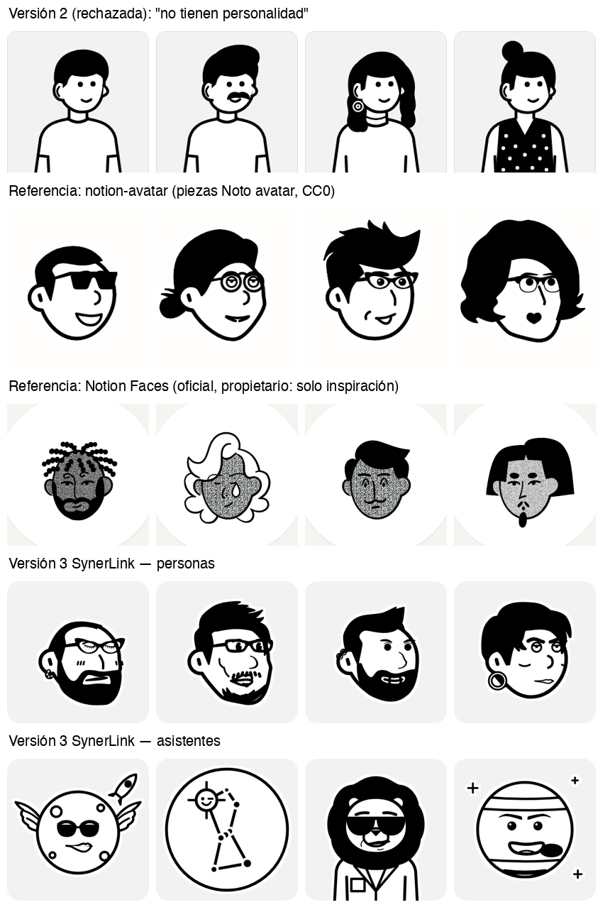
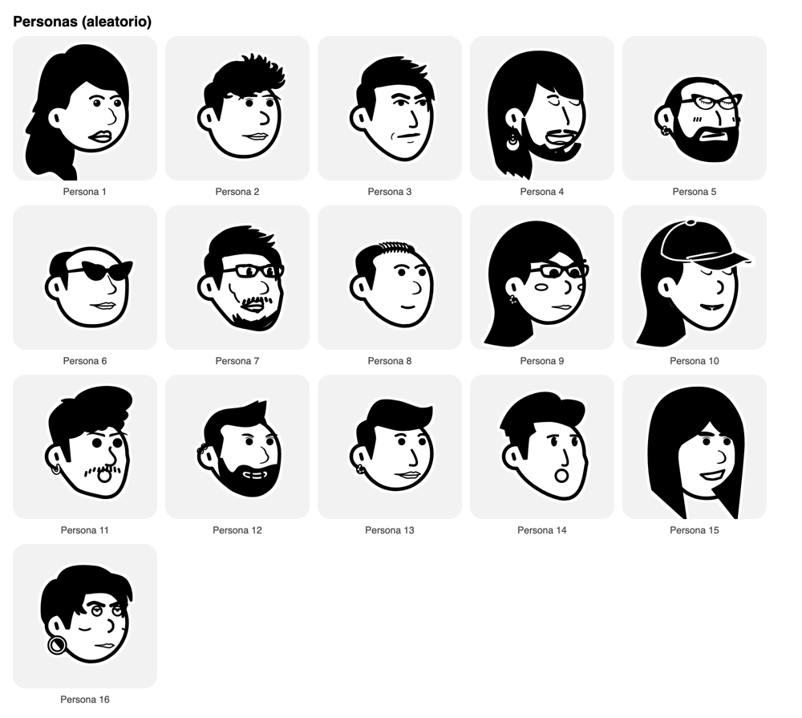
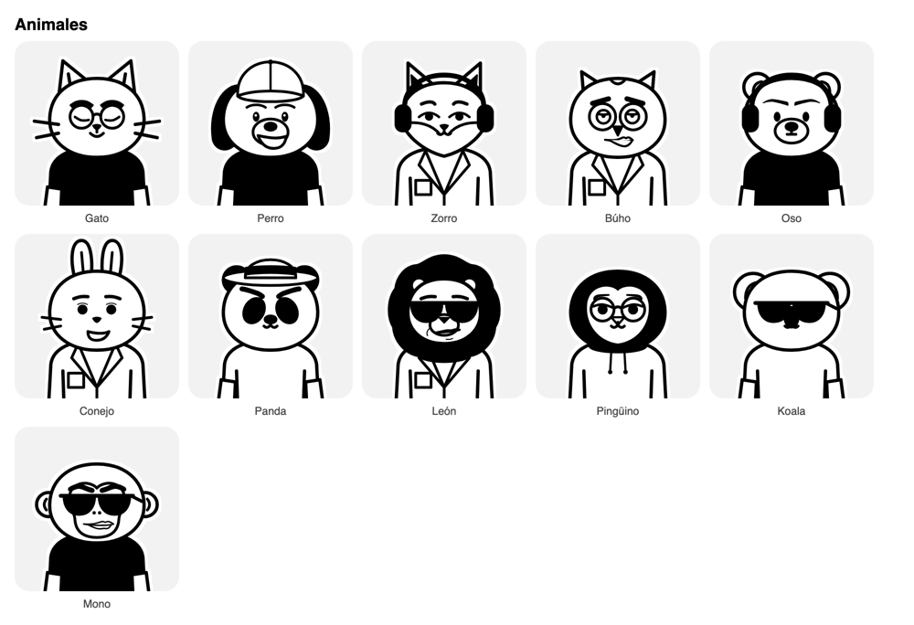
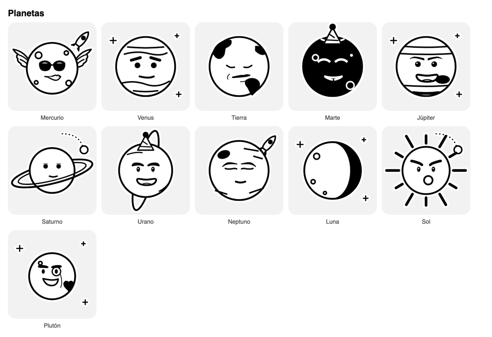
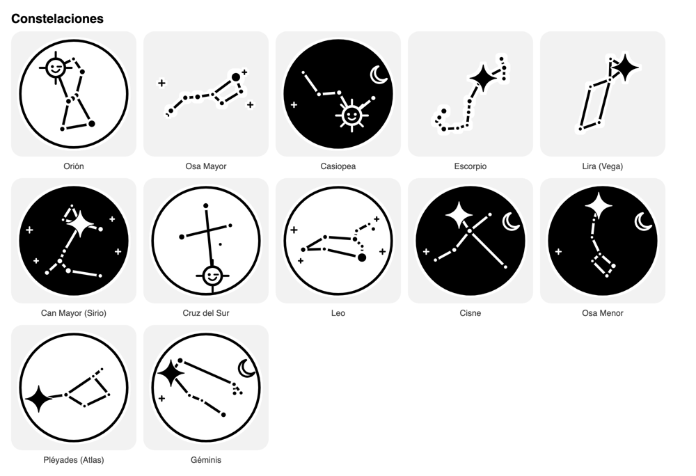
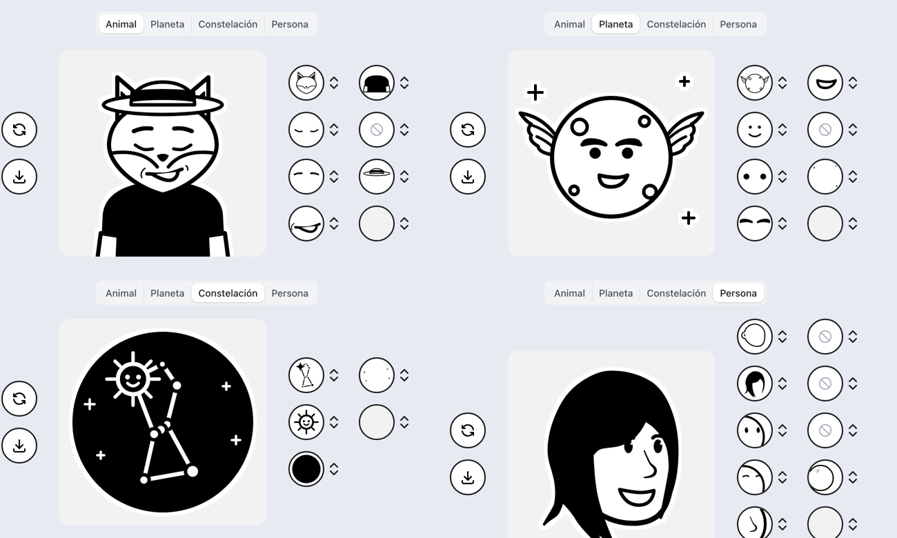
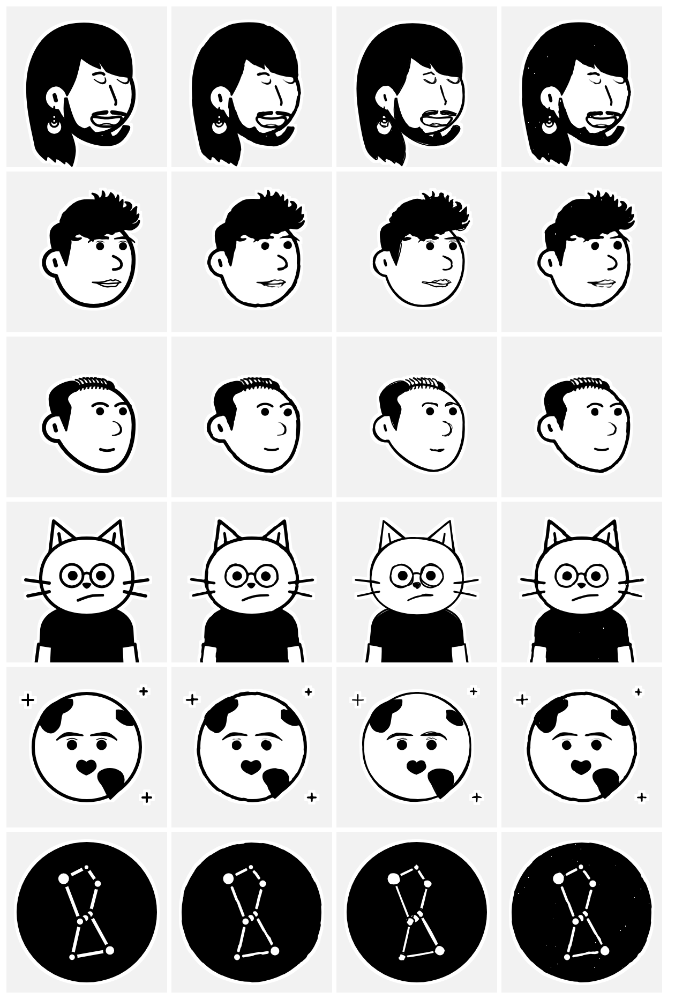

# Avatar estilo Notion (Perfil y asistentes del chat)

Editor de avatar en **Perfil → Mi avatar** y, para los asistentes de los que la persona es responsable (o si es administradora), en **Perfil → Avatar de mis asistentes**.



## Versión 3 (2026-10-08): con personalidad

La versión 2 (dibujos propios, cuerpo de frente y cara mínima) se descartó con este comentario: *"aún no me gusta, no tienen personalidad"*. En la versión 3 cambian tres cosas:

1. **Las personas usan las piezas de "Noto avatar"**: son las mismas de notion-avatar, con licencia CC0 (ver la sección de licencias).
2. **Los asistentes tienen cuatro categorías**: Animal, Planeta, Constelación y Persona.
3. **Los asistentes de OLP arrancan con un avatar sugerido** según su nombre.

### Qué le da personalidad a un avatar Notion

Se estudiaron notion-avatar (Mayandev), Notion Faces (el creador oficial de Notion, dibujado por el estudio BUCK con el estilo de Roman Muradov) y Avatartion. La personalidad no sale del cuerpo ni de los colores. Sale de la **cara**:

- **Expresión por piezas independientes**: hay 16 cejas (rectas, arqueadas, fruncidas, levantadas de un lado), 14 ojos (punto, entrecerrados, cerrados, con ojeras, con pestañas) y 20 bocas (labios, mueca, "o" de sorpresa, sonrisa abierta, lengua, corazón). Al combinarlas al azar salen gestos distintos: escéptico, coqueto, aburrido o sorprendido.
- **Asimetría**: la cabeza va en 3/4, con una sola oreja y la nariz de perfil, y una ceja puede quedar más alta que la otra. La cara de frente y simétrica se ve "de catálogo".
- **Cabello con carácter**: hay 58 peinados (copete, rapado, rizos, moño, melena o cresta) en manchas negras sólidas, de silueta reconocible incluso a 28 px.
- **Accesorios con intención**: gafas de gato, gafas de sol, monóculo, expansor, piercing, gorra o audífonos. Notion Faces suma toques lúdicos como el gorro de fiesta o el tercer ojo.
- **Solo la cabeza**: el rostro llena el círculo y a 28 px el gesto se sigue leyendo.
- **Halo blanco** alrededor del dibujo, como en notion-avatar: despega el dibujo del fondo.

### Cómo los generan

- **notion-avatar**: cada categoría es una carpeta de SVG numerados (`face/0.svg`, `hair/12.svg`…) en un lienzo común de 1080×1080. La configuración es un objeto `{ face, nose, mouth, eyes, eyebrows, glasses, hair, accessories, details, beard }` con un índice por categoría. Para dibujar, quita la etiqueta `<svg>` de cada pieza y las apila en grupos dentro de un SVG de 1080, en este orden: cara, nariz, boca, ojos, cejas, gafas, cabello, accesorios, detalles y barba. Después aplica un filtro `feMorphology` que agrega el halo blanco. El aleatorio (`getRandomStyle`) toma un índice al azar en cada categoría y deja barba, detalles y accesorios en 0 "por armonía".
- **Notion Faces**: es el mismo principio de capas (tono de piel, ojos, cejas, gafas, nariz, boca, cabello y accesorios), con trama de puntos en la piel. Sus dibujos son de Notion: **no se usan**, solo se tomó la idea.
- **SynerLink** reproduce el mismo principio con su propio código (`lib/avatar/compose.ts`):
  - guarda solo los índices;
  - compone el SVG en el servidor y en el navegador;
  - monta las piezas de 1080 en el lienzo de 300 con un único `translate/scale`;
  - el aleatorio da **peso** a lo opcional: barba ≈ 25 %, gafas ≈ 35 %, accesorio ≈ 20 % y detalle ≈ 25 %. Así salen avatares con identidad y no siempre "limpios".

### Asistentes

| Categoría | Qué trae |
|---|---|
| **Animal** | Gato, perro, zorro, búho, oso, conejo, panda, león, pingüino, koala y mono. Ahora tienen **ojos y cejas de Noto** y las bocas de Noto se suman al final, así que hay animal escéptico, coqueto o bravo. Conservan la ropa, las gafas y los accesorios. |
| **Planeta** | Mercurio (con alas de mensajero), Venus, Tierra, Marte (negro, con la carita en blanco), Júpiter (con la Gran Mancha), Saturno (con anillos por delante y por detrás), Urano (anillo casi vertical), Neptuno, Luna, Sol y Plutón (con su corazón). La **carita es opcional** y se arma con ojos, cejas y boca de Noto. Accesorios: gafas de sol, monóculo y gorro de fiesta. Decorados: chispas, satélite y cohete. |
| **Constelación** | Orión, Osa Mayor, Casiopea, Escorpio, Lira (Vega), Can Mayor (Sirio), Cruz del Sur, Leo, Cisne, Osa Menor, Pléyades (Atlas) y Géminis. Se dibujan con las **coordenadas reales** de sus estrellas (ascensión recta y declinación) en proyección gnomónica, con el norte arriba y el este a la izquierda, como se ven en el cielo. El tamaño del punto depende del brillo. La **estrella principal** se destaca con un destello, un punto grande, una carita o un guiño. El marco puede ser círculo blanco, "cielo negro" (figura en blanco) o sin marco. El cielo admite chispas o luna. |
| **Persona** | El mismo editor de las personas. |







### Sugerencia por nombre (OLP)

Si un asistente todavía no tiene avatar, el editor abre con uno sugerido (`lib/avatar/sugerencias.ts`):

| Asistente | Sugerencia |
|---|---|
| Orión | Constelación de Orión, cielo negro y estrella con carita |
| Vega | Lira, con Vega destacada |
| Sirio | Can Mayor, con Sirio guiñando |
| Atlas | Pléyades (Atlas es una de ellas) |
| Mercurio | Planeta Mercurio con alas |
| Galileo | Júpiter con monóculo (Galileo descubrió sus lunas) |
| Kepler | Marte (de su órbita sacó sus leyes) |

Es solo un punto de partida. Nada se guarda hasta que la persona pulsa **Guardar**.

## Licencias

| Fuente | Código | Dibujos | Qué se usó |
|---|---|---|---|
| **Noto avatar** (Felix Wong), vía [Mayandev/notion-avatar](https://github.com/Mayandev/notion-avatar) | MIT | **CC0 1.0**: dominio público. Lo dicen el README ("Assets licensed under CC0") y las preguntas frecuentes del sitio ("released under the CC0 license, allowing commercial use without attribution"). | **Las piezas SVG**: cara, cabello, ojos, cejas, nariz, boca, barba, gafas, accesorios y detalles. Van en `lib/avatar/noto/parts.generated.ts`, con la atribución y la licencia en `lib/avatar/noto/LICENSE.md`. No se copió código de notion-avatar. |
| **Avatartion** (wilmerterrero) | MIT | **DrawKit**: su licencia prohíbe usarlos en creadores de avatares y redistribuirlos | Solo la **idea de la interfaz**: círculo por parte, selector paginado, botones Aleatorio y Descargar. Ningún dibujo. |
| **Notion Faces** (Notion y BUCK) | Propietario | Propietarios | Solo la **idea**: personalidad por expresión y accesorios lúdicos. Ningún dibujo. |
| **Animales, planetas y constelaciones** | — | **Propios de SynerLink** | Dibujados a mano en `parts-animal.ts`, `parts-planeta.ts` y `parts-constelacion.ts`. Sus caritas reutilizan piezas de Noto (CC0). |

**Conclusión:** las piezas de Noto se pueden usar, también con fines comerciales y modificadas, porque son CC0. Igual se deja la atribución por cortesía y trazabilidad. Las de DrawKit y las de Notion **no** se pueden usar.

Para actualizar las piezas de Noto:

```
git clone --depth 1 https://github.com/Mayandev/notion-avatar.git /tmp/na
node scripts/avatar/import-noto.mjs /tmp/na
```

El script limpia los ids y normaliza los colores a `#000` y `#fff`. También rechaza cualquier marcado peligroso (`script`, `image`, `use`, `href`, `on*=`).

## Estilo y reglas técnicas

- **Blanco y negro puro**: el dibujo solo usa `#000` y `#fff`, y lo verifica una prueba. Los fondos son gris claro, blanco o transparente.
- **Halo blanco** (`feMorphology`) alrededor de todo el dibujo.
- El SVG de las personas pesa unos 230 KB de piezas en el código. Se comparte entre el editor y el endpoint, y la imagen final que se sirve pesa unos pocos KB.

## Cómo funciona

1. Se guarda solo la **configuración** en `dbo.avatar_config`: los índices de las partes, en unos 200 caracteres de JSON. La imagen no se guarda.
2. `GET /api/avatar/user/<id>` y `GET /api/avatar/agent/<code>` componen el SVG al vuelo. Ambas exigen sesión y tienen caché inmutable gracias a `?v=<fecha>`.
3. Al guardar, `user.image` o `agent.avatar_url` pasa a apuntar a esa URL. Así el encabezado, el chat, los grupos y las menciones lo muestran sin tocar esas pantallas. La foto anterior queda en `previous_image`, y **Quitar avatar** la devuelve.
4. En los agentes gana el cambio **más reciente** entre el avatar Notion y la foto subida por un administrador (`agentAvatarSrc`).

## Base de datos

- Script: `prisma/manual/2026-10-06-avatar-config.sql`. Es idempotente y solo crea la tabla.
- Reversa: `prisma/manual/2026-10-06-avatar-config-reversa.sql`.
- No cambia `schema.prisma`. Si el código sale antes que el script, el Perfil avisa que la función "aún no está habilitada" y no deja guardar.

## Reglas para el catálogo

- **Reestructuración de la versión 3**: como nada se había desplegado ni guardado (la tabla no existe en ninguna base), el catálogo de **personas** se reemplazó completo. Las categorías nuevas quedan así: `cara, cabello, ojos, cejas, nariz, boca, barba, gafas, accesorios, detalles`; ya no hay `ropa`. Los animales ganaron `cejas` y se crearon los tipos `planeta` y `constelacion`.
- **Desde aquí, no se reordena ni se borra nada**: la base guarda índices y lo nuevo va al final. La prueba "el catálogo no se reordena" fija los nombres y los conteos.
- En personas, el índice de cada opción es el número del archivo de Noto (`0.svg`, `1.svg`…).

## Trazo a lápiz (prototipo, 2026-10-08)

Pregunta de Nicolás: "¿no se puede simular el trazo como si fuera lápiz?". Los
dibujos de Avatartion (DrawKit) no se pueden usar, pero la sensación "hecha a
mano" sí se puede lograr sobre NUESTROS dibujos (Noto CC0 y propios) cambiando
cómo se trazan. `composeAvatarSvg(config, { style })` acepta:

- `'plano'` (por defecto): el de siempre; nada cambia si no se pasa `style`.
- `'lapiz'`: filtro SVG (turbulencia + desplazamiento) dentro del mismo filtro
  del halo: línea ondulada a pulso, grosor que varía a lo largo del trazo y
  trazo un 15 % más fino. Recomendado.
- `'grafito'`: lo anterior más un grano muy escaso dentro de los negros.

Semilla fija por avatar (hash de la configuración): el mismo avatar se ve igual
en servidor y cliente. El efecto va en unidades del lienzo, así que a 40/28 px
casi no se nota y no ensucia el chat. Costo medido en Chromium: +0,2 ms por
avatar distinto al rasterizar (el `` queda en caché). Sin dependencias.

Se evaluó también rough.js (MIT, 27,7 KB / 8,9 KB gzip): el bosquejo de doble
línea se ve desordenado en caras pequeñas, triplica el SVG (~18 KB) y sería
dependencia nueva; si se quisiera, convendría pre-generar los trazos en build.

Columnas: sin efecto · lápiz (filtro) · rough.js · grafito.


