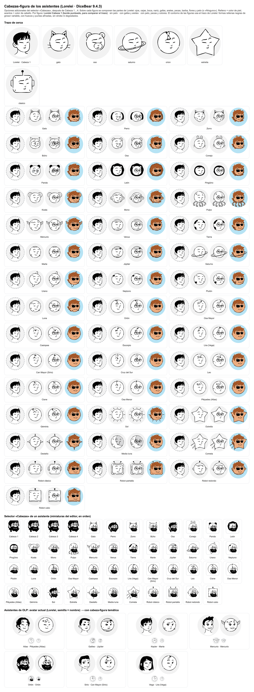

# Avatar estilo Notion (Perfil y asistentes del chat) — DiceBear 9 · Lorelei

Editor de avatar en **Perfil → Mi avatar** y, para los asistentes de los que la persona es responsable (o si es administradora), en **Perfil → Avatar de mis asistentes**.


## Versión 4 (2026-10-08): DiceBear 9 + Lorelei

Decisión de Nicolás Rivera: el feature se adapta a lo que trae la librería. El motor de piezas propio (versiones 1 a 3: piezas Noto, animales, planetas, constelaciones y prototipo a lápiz) se retiró.

- Dependencias con versión **exacta** (sin `^`): `@dicebear/core` **9.4.3** y `@dicebear/lorelei` **9.4.3**.
- **Por qué la 9 y no la 10:** DiceBear 10 (`@dicebear/core` 10 + `@dicebear/styles`) exige Node ≥ 22, y la CI y los servidores de despliegue (.230 testing y serfarma05 producción) corren Node **20.14**. Se probó la 10 y se volvió a la 9 (decisión de Nicolás Rivera, 2026-10-08); subir de versión requiere antes actualizar Node en los servidores.
- El servidor (`GET /api/avatar/user/<id>` y `GET /api/avatar/agent/<code>`) genera el SVG con `createAvatar(lorelei, opciones)`.
- El editor del Perfil usa **el mismo módulo** (`lib/avatar/compose.ts`) y pinta todo con `` (`avatarDataUri`/`thumbDataUri`), nunca SVG en línea, para que no haya diferencias de hidratación entre servidor y navegador.
- El catálogo sale del **esquema** de Lorelei instalado (`lorelei.schema.properties.*.items.enum`), no de una lista copiada.

### Opciones (exactamente las de Lorelei)

| Botón | Opción de DiceBear | Valores |
|---|---|---|
| Cabello | `hair` | 48 |
| Cabeza | `head` | 4 |
| Ojos | `eyes` | 24 |
| Cejas | `eyebrows` | 13 |
| Boca | `mouth` | 27 (18 `happy*` + 9 `sad*`); **asistentes: solo las 18 `happy*`** |
| Nariz | `nose` | 6 |
| Gafas | `glasses` / `glassesProbability` | ninguna + 5 |
| Aretes | `earrings` / `earringsProbability` | ninguno + 3 |
| Barba | `beard` / `beardProbability` | ninguna + 2 |
| Pecas | `freckles` / `frecklesProbability` | ninguna + 1 |
| Flores | `hairAccessories` / `hairAccessoriesProbability` | ninguna + flores |
| Color de cabello | `hairColor` | 7 (negro por defecto) |
| Color de piel | `skinColor` | 7 (blanco/línea por defecto) |
| Fondo | `backgroundColor` | 8 (gris claro por defecto, incluye transparente) |
| Voltear | `flip` | booleano en DiceBear 9: sin voltear / volteado (espejo) |

**Aleatorio** usa el azar de DiceBear (con las probabilidades de Lorelei: gafas 10 %, aretes 10 %, barba 5 %, pecas 5 %, flores 5 %) y conserva los colores elegidos. Lo que DiceBear elige (`toJson().extra`) se vuelve configuración explícita.

### Asistentes del chat

En los asistentes aplica lo siguiente (desde el 2026-10-08 su cabeza también puede ser una figura: ver «Cabezas-figura para los asistentes»).

- **Semilla = nombre del asistente** (Atlas, Galileo, Kepler, Mercurio, Orión, Sirio, Vega…). Es el avatar con el que abre el editor si aún no tiene uno, y el servidor guarda siempre `seed` = nombre del asistente.
- **Bocas limitadas a `happy*`**: el editor solo las ofrece, el aleatorio solo las elige y el servidor rechaza cualquier otra (`parseAvatarConfig(…, 'agent')`).

## Cabezas-figura para los asistentes (2026-10-08)

Pedido de Nicolás Rivera (SynerLink c47, mensajes 15785 y anteriores): en **Perfil → Avatar de mis asistentes**, las figuras (animales, planetas, constelaciones, estrellas, robots) son **opciones adicionales del selector «Cabezas»** de Lorelei, después de Cabeza 1…4, para que sean **compatibles con los demás accesorios**: sobre la figura se siguen componiendo ojos, cejas, boca, nariz, gafas, aretes, pecas, barba, flores y pelo (o «Ninguno»), con sus colores. Sustituye a la primera versión (#554), que las ponía en pestañas aparte con caritas propias. El avatar de las personas (Mi avatar) y su editor no cambian.



| Grupo | Cabezas-figura (valor de `head`: `figura:<id>`) |
|---|---|
| Animal (12) | gato, perro, zorro, búho, oso, conejo, panda, león, pingüino, koala, mono, pulpo |
| Planeta (10) | Mercurio (con alas), Venus, Tierra, Marte, Júpiter, Saturno (anillos), Urano (anillo vertical), Neptuno, Plutón (corazón), Luna |
| Constelación (12) | Orión, Osa Mayor, Casiopea, Escorpio, Lira (Vega), Can Mayor (Sirio), Cruz del Sur, Leo, Cisne, Osa Menor, Pléyades (Atlas), Géminis — en la frente, con las coordenadas reales de sus estrellas |
| Estrella (5) | sol, estrella, destello, media luna, cometa |
| Robot (4) | clásico, pantalla, redondo, cubo |

- **Cómo se compone** (`lib/avatar/cabezas.ts`): `loreleiCabezas` es un *style* propio de DiceBear que se usa con el mismo `createAvatar` de `@dicebear/core` 9.4.3 y que por dentro llama al `create` de la Lorelei instalada. Lorelei 9.4.3 no exporta sus componentes (su `package.json` solo expone `lib/index.js`), así que no se puede ampliar su componente `head` sin copiar ~150 KB de Lorelei; en cambio, el style pide a Lorelei renders auxiliares con alguna parte vacía y separa, por igualdad **exacta** de texto, los trazos de la cabeza, la cara (ojos, cejas, aretes, pecas, nariz, barba, boca, gafas) y el pelo de atrás/adelante. La figura reemplaza solo los trazos de la cabeza; si algo no cuadra, lanza un error (las pruebas recorren todas las figuras × los 48 pelos y comprueban que el SVG es el de Lorelei con la Cabeza 1 cambiada por la figura).
- **Coordenadas**: las figuras se dibujan en un lienzo de 300 y se llevan al grupo de la cabeza de Lorelei (`matrix(2.85 …)`: el punto (152, 140) cae en (505, 470) del lienzo de 980, el centro de la cara a 3/4 de Lorelei), con línea negra como la de Lorelei y cabiendo en el círculo del avatar.
- **Trazo de Lorelei** (pedido de Nicolás, msg 15787; `lib/avatar/pincel.ts`): medido en el SVG de Lorelei 9.4.3, sus contornos **no usan stroke**: son formas rellenas de `#000` de grosor variable, partidas en varios trazos con pequeños huecos y puntas afinadas, sin degradados ni transparencias. Grosor medido (2·área/perímetro en el lienzo de 980) en las cabezas variant01…04: 14,0 · 12,2 · 12,0 · 9,8. Las figuras se escriben con stroke por comodidad, pero al componerse cada contorno se convierte en ese mismo tipo de forma rellena, con grosor base 12,5 en el lienzo de 980 (misma escala y mismas coordenadas de la cabeza de Lorelei); medido igual sobre las figuras queda entre 10,8 y 13,8. Las sombras (panda, media luna) son colores planos mezclados, no transparencias. El SVG final de una cabeza-figura no lleva `stroke`, `opacity` ni degradados (hay prueba).
- **Colores**: relleno de la figura = color de piel; acentos (orejas del panda, continentes, constelación, antenas…) = color de cabello; fondo = el de siempre. Blanco y negro por defecto.
- **Pelo**: al elegir una figura, el pelo queda en «Ninguno» salvo en perro, oso y sol (donde el pelo de Lorelei tiene sentido); se puede poner cualquier pelo encima. Con una cabeza-figura, el selector de cabello ofrece «Ninguno»; al volver a Cabeza 1…4 sin pelo, se pone el pelo que DiceBear le da al nombre del asistente.
- **Modelo** (`dbo.avatar_config.config_json`, sin cambio de esquema): sigue siendo la **versión 3**; la figura es un valor más de `head` y `hair` puede ser `null`:

  ```json
  {"v":3,"estilo":"lorelei","seed":"Kepler","hair":null,"head":"figura:marte","eyes":"variant23",
   "eyebrows":"variant12","mouth":"happy08","nose":"variant06","glasses":null,"earrings":null,"beard":null,
   "freckles":null,"hairAccessories":null,"hairColor":"000000","skinColor":"ffffff","backgroundColor":"f2f2f2",
   "flip":false}
  ```

  `parseAvatarConfig(…, 'agent')` acepta `figura:<id>` del catálogo y `hair: null` **solo** con una cabeza-figura; `parseAvatarConfig(…, 'user')` rechaza ambas cosas. Los v3 ya guardados se dibujan **byte a byte igual** (siguen saliendo de `createAvatar(lorelei, …)`; prueba con hashes generados en 1a1fd46: `lib/avatar/__tests__/fixtures/v3-1a1fd46.json`).
- **Figuras v4 del #554**: el editor ya no las ofrece (se quitaron las pestañas Persona/Animal/Planeta/Constelación/Estrella/Robot y `FiguraEditor`). Lo guardado en v4 **no se borra**: `parseAgentAvatarConfig` lo sigue validando con las reglas de entonces y lo **convierte al leerlo** (`lib/avatar/figuras.ts`) a la cabeza-figura equivalente, sin pelo, con ojos y boca de Lorelei parecidos a la carita y los mismos colores (relleno → piel, acento → cabello). Al guardarlo desde el editor queda en v3. En KRONOSDB_PRUEBAS había uno (agente 1: gato).
- **Origen y licencia**: dibujo **propio de SynerLink** (la geometría de las figuras del #554 / `feat/avatar-avatartion` 8c53716, sin sus caritas), sin dependencias nuevas.

## Licencias

| Paquete | Licencia |
|---|---|
| `@dicebear/core` 9.4.3 | MIT (Florian Körner) |
| `@dicebear/lorelei` 9.4.3 | Código MIT. **Diseño "Lorelei" de Lisa Wischofsky, CC0 1.0** (dominio público). |

Cada SVG generado lleva la atribución en su `<metadata>`. Del proyecto Avatartion (MIT) se mantiene solo la **idea de la interfaz**.

## Cómo funciona

1. Se guarda solo la **configuración** en `dbo.avatar_config.config_json` (versión 3, ~340 caracteres):

   ```json
   {"v":3,"estilo":"lorelei","seed":"Orión","hair":"variant25","head":"variant03","eyes":"variant02",
    "eyebrows":"variant13","mouth":"happy10","nose":"variant05","glasses":null,"earrings":null,"beard":null,
    "freckles":null,"hairAccessories":null,"hairColor":"000000","skinColor":"ffffff","backgroundColor":"f2f2f2",
    "flip":false}
   ```

   `parseAvatarConfig` es estricta: solo versión 3, solo claves conocidas, variantes que existan en el esquema instalado, `flip` booleano, colores hexadecimales y, en asistentes, boca `happy*`.
2. Los endpoints generan el SVG al vuelo. Exigen sesión y tienen caché inmutable gracias a `?v=<fecha>`.
3. Al guardar, `user.image` o `agent.avatar_url` apunta a esa URL; la foto anterior queda en `previous_image` y **Quitar avatar** la devuelve.
4. En los agentes gana el cambio **más reciente** entre el avatar y la foto subida por un administrador (`agentAvatarSrc`).

## Base de datos

- Script: `prisma/manual/2026-10-06-avatar-config.sql` (idempotente; solo crea la tabla). **Sin cambios de esquema** respecto al PR #520: `config_json NVARCHAR(1000)` alcanza. Solo cambió el comentario de ejemplo.
- Reversa: `prisma/manual/2026-10-06-avatar-config-reversa.sql` (sin cambios).
- La tabla no existe en ninguna base, así que no hay configuraciones anteriores que migrar; una configuración vieja sería rechazada (404 → iniciales).

## Muestra

`node scripts/avatar/muestra-lorelei.mjs docs/avatar-notion/lorelei-muestra` genera la hoja HTML y el PNG (Playwright). Las cabezas-figura: `node scripts/avatar/muestra-cabezas-figura.mjs /tmp/avatares-cabezas-figura`.
