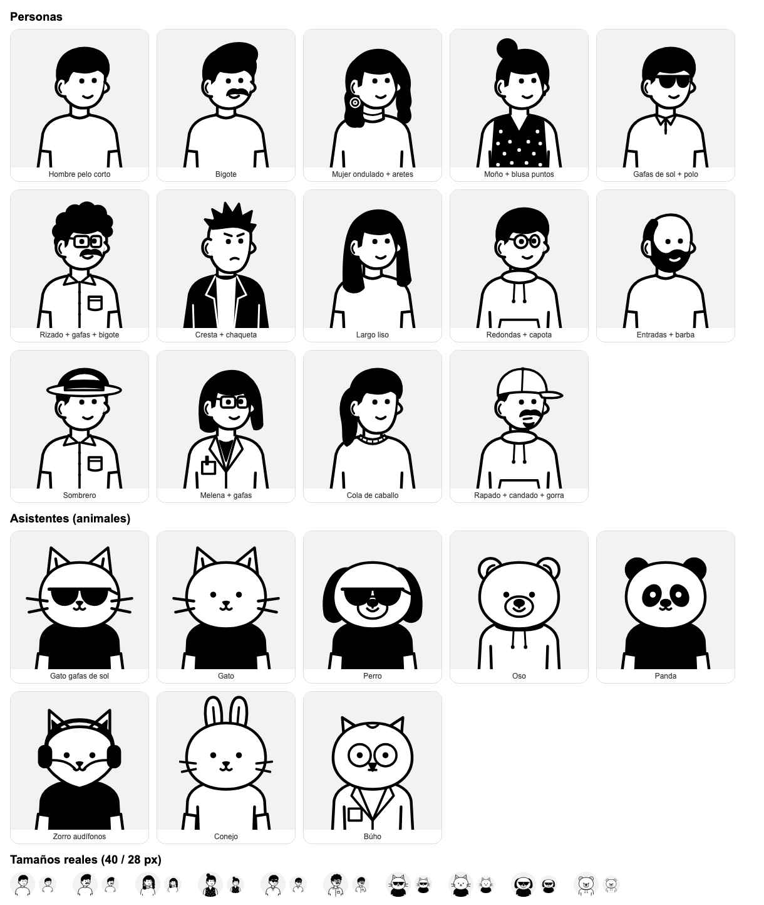
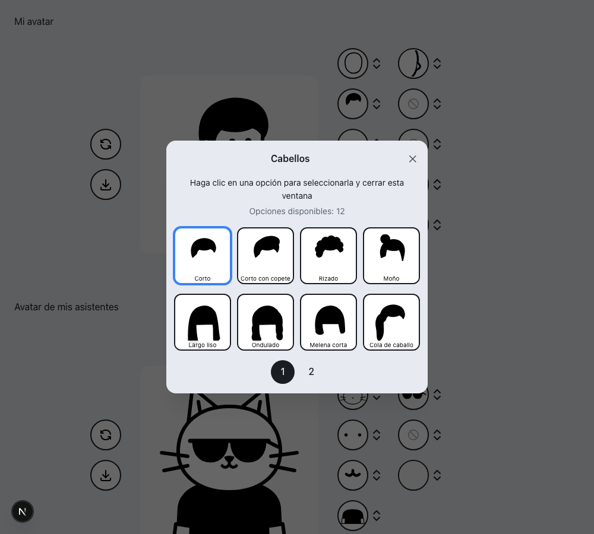

# Avatar estilo Notion (Perfil y asistentes del chat)

Editor de avatar en **Perfil → Mi avatar** y, para los asistentes de los que la persona es responsable (o si es administradora), en **Perfil → Avatar de mis asistentes**.

## Estilo (versión 2, 2026-10-07)

La primera versión (con colores de fondo, pecas y tramas) se descartó. El estilo vigente:

- **Blanco y negro puro**: el dibujo solo usa `#000` y `#fff` (lo verifica una prueba). Los fondos son neutros: gris claro, blanco o transparente.
- **Trazo grueso y parejo** (6 px en el lienzo de 300) con puntas redondas.
- **Persona en 3/4**: mira un poco a la derecha, con una sola oreja visible (capa fija encima del cabello) y la nariz como un bulto del perfil.
- **Cara mínima**: ojos de punto y sonrisa corta.
- **Rellenos negros sólidos** en cabello, barba, gafas de sol y ropa oscura.
- **Máximo un accesorio**: el aleatorio nunca junta gafas con accesorio (salvo los aretes).
- **Asistentes**: animales de cabeza grande, con camiseta negra por defecto y gafas de sol opcionales.

## Origen y licencia

- **Interfaz**: calco del comportamiento y la disposición de [Avatartion](https://github.com/wilmerterrero/Avatartion) (código bajo licencia **MIT**, © 2022 Wilmer Terrero). No se copió código fuente literal: se reescribió con Mantine y CSS Modules.
- **Dibujos**: **propios de SynerLink** (`lib/avatar/parts-persona.ts` y `lib/avatar/parts-animal.ts`). Las ilustraciones de Avatartion son de **DrawKit**, y su licencia prohíbe incluirlas "en creadores de diseño o aplicaciones" y redistribuirlas como compilación. Por eso **no se incluyó ningún SVG de Avatartion**. Si algún día se quieren usar, primero hay que pedirle autorización escrita a DrawKit.
- **Sin dependencias nuevas**: no cambia `package.json`.

## Cómo funciona

1. Se guarda solo la **configuración** (índices de partes, unos 150 caracteres de JSON) en `dbo.avatar_config`. La imagen no se guarda.
2. `GET /api/avatar/user/<id>` y `GET /api/avatar/agent/<code>` componen el SVG al vuelo. Ambas exigen sesión y tienen caché inmutable gracias a `?v=<fecha>`.
3. Al guardar, `user.image` o `agent.avatar_url` pasa a apuntar a esa URL. Así el encabezado, el chat, los grupos y las menciones lo muestran sin tocar esas pantallas. La foto anterior queda en `previous_image`, y **Quitar avatar** la devuelve.
4. En los agentes gana el cambio **más reciente** entre el avatar Notion y la foto subida por un administrador (`agentAvatarSrc`).

## Base de datos

- Script: `prisma/manual/2026-10-06-avatar-config.sql`. Es idempotente y solo crea la tabla.
- Reversa: `prisma/manual/2026-10-06-avatar-config-reversa.sql`. Primero devuelve las fotos anteriores y luego borra la tabla.
- No cambia `schema.prisma`. Si el código sale antes que el script, el Perfil avisa que la función "aún no está habilitada" y no deja guardar. Nada más se afecta.

## Reglas para el catálogo

- **No reordenar ni borrar opciones**: la base guarda índices. Las opciones nuevas van al final.
- Todas las partes respetan la rejilla del lienzo de 300×300 que se describe al inicio de `parts-persona.ts`.
