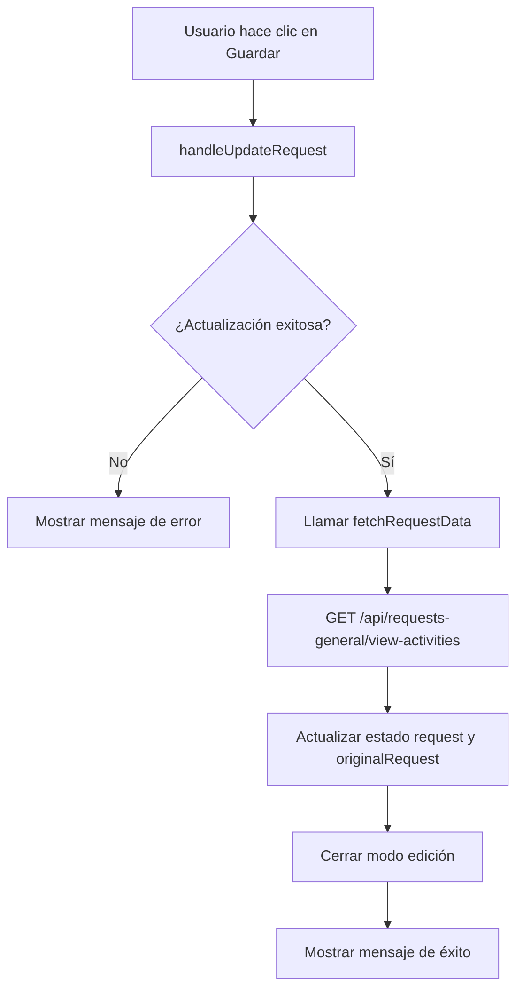

# Plan: Refrescar datos después de actualizar actividad

## Problema Identificado

En el archivo [`view-activities/page.tsx`](app/process/request-general/view-activities/page.tsx), la función `handleUpdateRequest` (líneas 492-611) no refresca los datos desde el servidor después de una actualización exitosa. Actualmente solo actualiza manualmente el campo `status`:

```typescript
if (resolutionData.estado) {
  setRequest((prev) => (prev ? { ...prev, status: resolutionData.estado } : null));
}
```

Esto significa que campos como `start_date`, `end_date`, `resolution`, `date_resolution` y `status_task` no se actualizan en la interfaz después de guardar.

## Solución Propuesta

### Crear función `fetchRequestData`

Crear una nueva función para obtener los datos actualizados de la actividad desde el servidor, similar a las funciones existentes `fetchNotes()` y `fetchFolderContents()`.

**Ubicación:** Después de la función `fetchFolderContents()` (aproximadamente línea 343)

```typescript
const fetchRequestData = async () => {
  if (!id) return;
  try {
    const response = await fetch(`/api/requests-general/view-activities?id=${id}`);
    if (!response.ok) throw new Error('Error al cargar la tarea');
    const data = await response.json();
    const mappedData = {
      ...data,
      resolution: data.resolutioncase || null,
      date_resolution: data.date_resolution || null,
    };
    setRequest(mappedData);
    setOriginalRequest(mappedData);
  } catch (err) {
    console.error('Error refreshing request data:', err);
  }
};
```

### Modificar `handleUpdateRequest`

Después de una actualización exitosa, llamar a `fetchRequestData()` para refrescar todos los datos desde el servidor.

**Ubicación:** En la función `handleUpdateRequest`, después de la línea 580 (donde se obtiene el resultado de la actualización)

**Código actual:**
```typescript
const result = await response.json();

if (resolutionData.estado) {
  setRequest((prev) => (prev ? { ...prev, status: resolutionData.estado } : null));
}

setOriginalRequest(request);
setIsEditing(false);
```

**Código propuesto:**
```typescript
const result = await response.json();

// Refrescar datos desde el servidor
await fetchRequestData();

setIsEditing(false);
```

## Diagrama de Flujo



## Archivos a Modificar

| Archivo | Cambio |
|---------|--------|
| [`app/process/request-general/view-activities/page.tsx`](app/process/request-general/view-activities/page.tsx) | Agregar función `fetchRequestData` y modificar `handleUpdateRequest` |

## Beneficios

1. **Datos consistentes:** La interfaz siempre mostrará los datos actualizados desde la base de datos
2. **Campos actualizados:** Todos los campos modificados por el servidor (incluyendo `date_resolution` calculado por GETDATE()) se reflejarán correctamente
3. **Estado sincronizado:** `request` y `originalRequest` se mantienen sincronizados con el servidor
